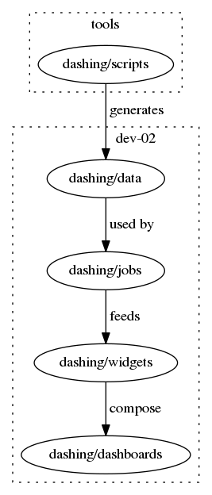

Smashing is a fork of [dashing project](http://dashing.io/)

````
# Install bundler
$ sudo apt-get install gem

$ gem install bundler
# Install smashing
$ gem install smashing
# Create a new project
$ smashing new my-project
# Change Directory into the project
$ cd my-project
# Install the bundle of project specific gems
$ bundle
# Start the example dashboard!
$ smashing start
````

## Run on a different port, or in production

    dashing start -p 5000 -e production

## Run in background

    dashing start -p 5000 -e production -d

Stop and restart:

    dashing stop && start -p 5000 -e production -d

# Dashing workflow



# Run locally with Docker

```SHELL
docker build -t dashing .
docker run -p "8030:3030" dashing
```

_Dashing is live at your localhost:8030_

# Cron tasks

On tools:
```SHELL
*/5 * * * * sh /home/sshuser/custom-scripts/dashing/list-orders.sh
*/5 * * * * sh /home/sshuser/custom-scripts/dashing/list-order-products.sh
```

These scripts execute list-orders.js and list-order-products.js queries and put json response to a file on dev-02 server.

# Sync test data with prod

```SHELL
scp -i ~/.ssh/id_oxalide.rsa sshuser@52.16.131.55:/home/sshuser/custom-scripts/dashing/temp/*.json ./data
```
